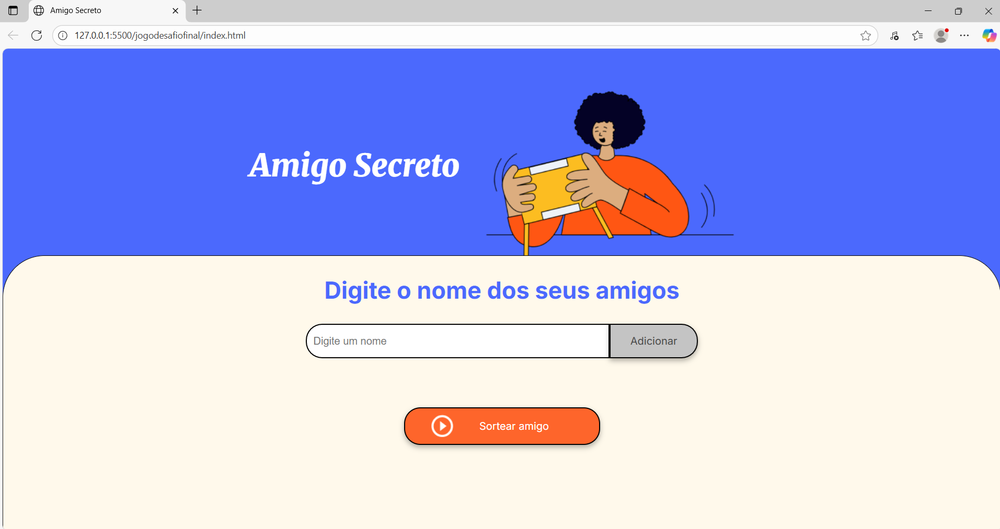

# 🎁 Amigo Secreto

Este é um projeto simples desenvolvido para o curso da **Alura**, com o objetivo de praticar **JavaScript**, **HTML** e **CSS**.  
O sistema permite que o usuário adicione nomes de amigos e realize um sorteio aleatório de forma interativa.


---

## 🚀 Funcionalidades
- ✅ Adicionar nomes à lista.  
- ✅ Validação para impedir entradas vazias.  
- ✅ Visualização dinâmica da lista de amigos.  
- ✅ Sorteio aleatório de um nome da lista.  

---

## 🖥️ Tecnologias Utilizadas
- HTML5
- CSS3
- JavaScript (ES6)

---

## 📂 Estrutura do Projeto

```
amigo-secreto/
├── index.html # Estrutura principal da página
├── style.css # Estilos visuais
├── app.js # Lógica do sorteio e manipulação da lista
└── assets/ # Pasta com imagens utilizadas no projeto
```

---

## 📸 Demonstração



---

## 🎯 Objetivo do Projeto
Este projeto foi desenvolvido como parte dos estudos no curso Alura e serve como base para consolidar conceitos de manipulação do DOM e lógica de programação em JavaScript.

---

## 👤 Autor
Feito com ❤️ por [Eduardo](https://www.linkedin.com/in/eduardolunardelli/)